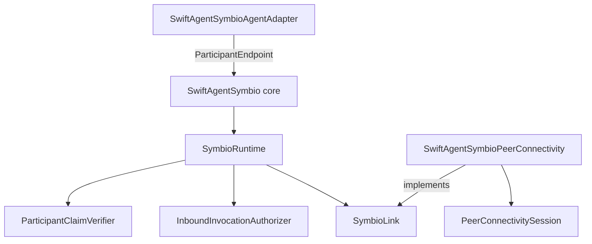

# SwiftAgentSymbio 設計

SwiftAgentSymbio は、participant の局所 view、所有権、信頼、routing、実行を扱う runtime である。`Community` は引き続き哲学上の coordination affordance とし、network 接続そのものとは分離する。

## 維持する原則

| 原則 | 実装上の契約 |
|---|---|
| 局所的な view | global registry を仮定せず、各 runtime が観測・信頼・block 状態を所有する |
| 所有権 | local participant だけを register/remove/shutdown できる |
| claim と authority の分離 | announcement は claim であり、verifier を通るまで routing に使わない |
| identity の分離 | participant ID、local handle、transport peer ID、verified binding を別型にする |
| fail-closed | claim verifier と inbound authorizer の既定値は拒否 |
| adapter 境界 | SwiftAgent、Foundation Data、Codable wire DTO、PeerConnectivity は adapter が所有する |
| 明示的な失敗 | timeout、policy deny、wire error、cleanup error を typed error/reply で返す |
| 観測の provenance | descriptor 宣言と runtime 観測を別々に保持し、公開 view でだけ統合する |

## 責務境界



依存方向は adapter から core への一方向である。core は `SwiftAgent`、`PeerConnectivity`、distributed actor runtime、Foundation の wire encoding を知らない。

## Identity と trust

| 型 | 生成者 | lifetime | 権限 |
|---|---|---|---|
| `ParticipantID` | application/descriptor | participant の論理 lifetime | 名前のみ。所有権を示さない |
| `ParticipantHandle` | `SymbioRuntime.register` | registration 終了まで | local sender/remove/availability 操作 |
| `TransportPeerID` | `SymbioLink` adapter | 接続 lifetime | 接続先の指定のみ |
| `SymbioPeerClaim` | adapter | verification 完了まで | 権限なし |
| `VerifiedParticipantBinding` | `ParticipantClaimVerifier` | peer 切断、withdraw、link 終了、runtime 停止まで | remote routing と principal の根拠 |

`PinnedParticipantClaimVerifier` は次の組を照合する。

```text
transport peer ID
  + participant ID
  + authentication method
  + authentication subject
  -> verified participant binding
```

verifier が `await` している間に peer が切断・再接続・withdraw される可能性があるため、runtime は peer generation と claim revision を保持し、検証完了時に再確認する。古い検証結果は state に反映しない。
binding は接続から派生した lease であり、永続的な participant state ではない。接続または link の lifetime が終わると binding を破棄し、その peer から受理済みの inbound invocation も cancel する。

## 実行フロー

### Outbound

```text
ParticipantHandle validation
  -> sender block/availability validation
  -> current RoutePlan
  -> policy authorization
  -> sender + route/policy/expiry revalidation
  -> local ParticipantEndpoint OR verified remote binding
  -> bounded invocation
  -> sender + endpoint/binding revalidation
  -> evidence update
```

policy authorizer の待機中に capability、policy、availability、binding が変化し得るため、authorization 後に route を再構築する。
sender の handle と availability も policy 待機後、および remote I/O 完了後に再検証し、失効した主体の結果を成功として返さない。

### Inbound

```text
SymbioLinkEvent.invocationReceived
  -> sender binding matches reply-context peer
  -> recipient endpoint exists
  -> capability and representation match
  -> [ InboundInvocationAuthorizer
  -> lifecycle/binding/endpoint revalidation
  -> endpoint invocation ] within one total execution budget
  -> typed success/failure reply
```

既定の `RejectingInboundInvocationAuthorizer` は全て拒否する。`AllowingInboundInvocationAuthorizer` は明示的に trust が成立した環境でのみ選択する。
送信元が指定した `executionBudget` と runtime 上限の小さい方は、endpoint だけでなく認可待機から endpoint 完了までの総予算である。認可を予算外にして inbound slot を無期限に占有させない。
peer 切断、participant withdraw、block、binding 置換、link 終了では、該当する runtime-owned inbound task を cancel する。authorizer と endpoint は cancellation を観測し、失効した principal の処理を継続してはならない。

## Participant endpoint

`ParticipantEndpoint` は endpoint の実行と shutdown の owner である。

`AggregateParticipantDescriptor` は複数 participant の観測・availability roll-up を表す view であり、実行 endpoint ではない。aggregate ID を直接 invoke しても route は成立しない。将来 aggregate execution を導入する場合も、member selection と failure policy を所有する専用 endpoint として明示的に追加する。

aggregate membership は有向非巡回グラフでなければならない。nested aggregate の availability は固定点まで更新し、member の `Availability.expiresAt` が失効している観測は available と数えない。したがって登録順や dictionary の列挙順は roll-up 結果を変えない。

descriptor が宣言した affordance と `observe(_ affordance:)` が追加した観測 affordance は、保存時点では混在させない。descriptor 置換は宣言集合を完全に置換し、観測集合は保持する。公開 `ParticipantView` では宣言側の owner/contract を authoritative とし、観測側の state/evidence/delivery を保守的に統合する。

```swift
public protocol ParticipantEndpoint: Actor {
    nonisolated var descriptor: ParticipantDescriptor { get }
    func invoke(_ invocation: SymbioInvocation) async throws -> OwnedBytes?
    func shutdown() async
}
```

`shutdown()` は新規 invocation を拒否し、既に所有している invocation を drain してから返す。`invoke` は task cancellation を観測する。

`SymbioRuntime.stop()` は一つの runtime-owned cleanup task を生成する。呼び出し元の cancellation は cleanup を中断せず、同時に呼ばれた `stop()` は同じ typed result を待つ。失敗した link cleanup は ownership を保持したまま次の `stop()` で再試行する。

SwiftAgent 固有の `CommunicableAgent`、`Perception`、`Data` 変換、`ReplicateTool` は `SwiftAgentSymbioAgentAdapter` に置く。action invocation は capability ID だけで input representation を推測せず、呼び出し側が契約の `MessageRepresentation` を渡す。

## PeerConnectivity adapter

`PeerConnectivitySymbioLink` は次を所有する。

| 対象 | 契約 |
|---|---|
| session | subscribe-before-start、one-shot lifecycle、terminal cleanup |
| peer map | `TransportPeerID` だけを key とする |
| event queue | bounded、single receiver、overflow は terminal failure |
| reply channel | opaque `SymbioReplyContext` により exactly-once で所有移転 |
| wire data | 4-byte big-endian length prefix付きのbounded JSON DTO。transport chunk境界はmessage境界として扱わず、`Data`/`OwnedBytes` copyはこの境界だけ |
| connection generation | channel を current peer identity/generation に束縛し、遅延完了と stale disconnect を拒否 |
| reply correlation | invocation ID を reply context と照合して越境を拒否 |
| I/O | 新規 operation は bounded。受理済み reply は別枠で必ず drain |
| shutdown | adapter-owned cleanup task で owned channel close と session shutdown を先に並行開始し、その後 task/I/O を drain |

session `start`、`openChannel`、channel `read`/`write` は、channel close または session
shutdown によって復帰する backend 契約を必要とする。startup も deadline
内で実行し、timeout/caller cancellation は session owner の cleanup を開始する。上流 protocol は
この解除保証を型で表現していないため、adapter の明示的な前提である。
cleanup task は shutdown 呼び出し元の cancellation から独立し、同時呼び出しは同じ cleanup を待つ。

既定 protocol ID:

| Stream | ID |
|---|---|
| announcement | `/swiftagent/symbio/announce/2.0.0` |
| invocation | `/swiftagent/symbio/invoke/2.0.0` |

announcement 内の descriptor は未検証である。authentication input は announcement から受け取らず、`PeerConnectivityPeer.identity` から構成する。

## Community の位置づけ

Community は共有作業面が必要な場合に選択される。

```text
goal + participants + context pressure + time scale + audit need
  -> direct conversation
  -> mediated coordination
  -> community substrate
```

transport event は到達性にすぎない。runtime が verification、observation、trust、policy を適用して初めて社会的な関係と実行可能な route になる。
