# SwiftAgent

[](https://deepwiki.com/1amageek/SwiftAgent)

SwiftAgent is a powerful Swift framework for building AI agents using a declarative SwiftUI-like syntax. It provides a type-safe, composable way to create complex agent workflows while maintaining Swift's expressiveness.

## Architecture Overview

```mermaid
graph TB
    subgraph "Core Protocol"
        Step["Step<Input, Output>"]
    end

    subgraph "OpenFoundationModels Integration"
        Tool["Tool Protocol"]
        LMS["LanguageModelSession"]
        Generable["@Generable"]
        Prompt["@PromptBuilder"]
        Instructions["@InstructionsBuilder"]
    end

    subgraph "Session Management"
        Session["@Session"]
        WithSession["withSession()"]
        SessionContext["SessionContext"]
    end

    subgraph "Built-in Steps"
        subgraph "Transform Steps"
            Transform["Transform"]
            Map["Map"]
            Reduce["Reduce"]
            Join["Join"]
        end

        subgraph "Control Flow"
            Loop["Loop"]
            Parallel["Parallel"]
            Race["Race"]
        end

        subgraph "AI Generation"
            Generate["Generate<T>"]
            GenerateText["GenerateText"]
        end
    end

    subgraph "Monitoring"
        Monitor["Monitor"]
        Tracing["Distributed Tracing"]
    end

    subgraph "Tools"
        ReadTool["ReadTool"]
        WriteTool["WriteTool"]
        EditTool["EditTool"]
        GrepTool["GrepTool"]
        GlobTool["GlobTool"]
        GitTool["GitTool"]
        ExecuteCommandTool["ExecuteCommandTool"]
        URLFetchTool["URLFetchTool"]
    end

    subgraph "MCP Integration"
        MCPClient["MCPClient"]
        MCPDynamicTool["MCPDynamicTool"]
    end

    Step --> Transform
    Step --> Map
    Step --> Loop
    Step --> Parallel
    Step --> Generate
    Step --> GenerateText

    Session --> SessionContext
    WithSession --> SessionContext
    SessionContext --> LMS

    Generate --> LMS
    GenerateText --> LMS

    Tool --> ReadTool
    Tool --> WriteTool
    Tool --> EditTool
    Tool --> ExecuteCommandTool

    MCPClient --> MCPDynamicTool
    MCPDynamicTool --> Tool
```



## Features

- **Declarative Syntax**: Build agents using familiar SwiftUI-like syntax
- **Composable Steps**: Chain multiple steps together seamlessly with StepBuilder
- **Type-Safe Tools**: Define and use tools with compile-time type checking
- **Model-Agnostic**: Works with any AI model through OpenFoundationModels
- **Modular Design**: Create reusable agent components
- **Async/Await Support**: Built for modern Swift concurrency
- **Protocol-Based**: Flexible and extensible architecture
- **@Session**: TaskLocal-based session management with property wrapper
- **Builder APIs**: Dynamic Instructions and Prompt construction with result builders
- **Monitoring**: Built-in monitoring and distributed tracing support
- **OpenTelemetry**: Industry-standard distributed tracing with swift-distributed-tracing
- **MCP Integration**: Optional Model Context Protocol support via SwiftAgentMCP
- **Chain Support**: Chain up to 8 steps with type-safe composition

## Core Components

### Steps

Steps are the fundamental building blocks in SwiftAgent. They process input and produce output in a type-safe manner:

```swift
public protocol Step<Input, Output> {
    associatedtype Input: Sendable
    associatedtype Output: Sendable

    func run(_ input: Input) async throws -> Output
}
```

## Session Management

SwiftAgent provides elegant session management through TaskLocal-based `@Session` property wrapper, similar to SwiftUI's `@Environment`. This enables session propagation through the Step hierarchy without manual parameter passing.

### @Session Property Wrapper

The `@Session` wrapper provides access to the current `LanguageModelSession` from the task context:

```swift
struct TranslateStep: Step {
    @Session var session: LanguageModelSession

    func run(_ input: String) async throws -> String {
        let response = try await session.respond {
            Prompt("Translate to Japanese: \(input)")
        }
        return response.content
    }
}
```

### withSession - Setting the Context

Use `withSession` to provide a session to the Step hierarchy:

```swift
let session = LanguageModelSession(model: myModel) {
    Instructions("You are a helpful translator")
}

let result = try await withSession(session) {
    try await TranslateStep().run("Hello, world!")
}
```

### Convenient Run with Session

You can also use the Step extension for a more concise syntax:

```swift
let result = try await TranslateStep().run("Hello", session: session)
```

### Nested Steps

Sessions automatically propagate through nested Steps:

```swift
struct OuterStep: Step {
    @Session var session: LanguageModelSession

    func run(_ input: String) async throws -> String {
        // InnerStep automatically gets the same session
        let processed = try await InnerStep().run(input)

        let response = try await session.respond {
            Prompt("Summarize: \(processed)")
        }
        return response.content
    }
}

struct InnerStep: Step {
    @Session var session: LanguageModelSession

    func run(_ input: String) async throws -> String {
        let response = try await session.respond {
            Prompt("Expand: \(input)")
        }
        return response.content
    }
}

// One withSession provides session to all nested Steps
try await withSession(session) {
    try await OuterStep().run("AI")
}
```

## AI Model Integration

SwiftAgent uses OpenFoundationModels for AI model integration, providing a unified interface for multiple AI providers:

### Dynamic Instructions with InstructionsBuilder

```swift
let session = LanguageModelSession(model: myModel) {
    Instructions {
        "You are an AI assistant"

        if userPreferences.verbose {
            "Provide detailed explanations"
        }

        for expertise in userExpertiseAreas {
            "You have expertise in \(expertise)"
        }

        "Always be helpful and accurate"
    }
}
```

### Dynamic Prompts with PromptBuilder

```swift
GenerateText(session: session) { input in
    Prompt {
        "User request: \(input)"

        if includeContext {
            "Context: \(contextInfo)"
        }

        for example in relevantExamples {
            "Example: \(example)"
        }

        "Please provide a comprehensive response"
    }
}
```

### Using Model Providers

SwiftAgent works with any AI provider through OpenFoundationModels:

```swift
import SwiftAgent
import OpenFoundationModels

let session = LanguageModelSession(
    model: YourModelFactory.create(apiKey: "your-api-key")
) {
    Instructions("You are a helpful assistant.")
}
```

### Available Provider Packages

SwiftAgent is provider-agnostic. Choose from available OpenFoundationModels provider packages:

- [OpenFoundationModels-OpenAI](https://github.com/1amageek/OpenFoundationModels-OpenAI) - OpenAI models (GPT-4o, etc.)
- [OpenFoundationModels-Ollama](https://github.com/1amageek/OpenFoundationModels-Ollama) - Local models via Ollama
- [OpenFoundationModels-Anthropic](https://github.com/1amageek/OpenFoundationModels-Anthropic) - Anthropic Claude models

## Built-in Steps

### Transform

Convert data from one type to another:

```swift
Transform<String, Int> { input in
    Int(input) ?? 0
}
```

### Generate

Generate structured output using AI models:

```swift
@Generable
struct Story {
    @Guide(description: "The story title")
    let title: String
    @Guide(description: "The story content")
    let content: String
}

struct StoryGenerator: Step {
    @Session var session: LanguageModelSession

    func run(_ topic: String) async throws -> Story {
        let generate = Generate<String, Story>(session: session) { input in
            Prompt {
                "Write a story about: \(input)"
                "Include vivid descriptions"
            }
        }
        return try await generate.run(topic)
    }
}

// Usage
let story = try await withSession(session) {
    try await StoryGenerator().run("a brave knight")
}
```

### GenerateText

Generate string output using AI models:

```swift
struct TextGenerator: Step {
    @Session var session: LanguageModelSession

    func run(_ topic: String) async throws -> String {
        let generate = GenerateText<String>(session: session) { input in
            Prompt("Write about: \(input)")
        }
        return try await generate.run(topic)
    }
}
```

### Loop

Iterate with a condition:

```swift
Loop(max: 5) { input in
    ProcessingStep()
} until: { output in
    output.meetsQualityCriteria
}
```

### Map

Process collections:

```swift
Map<[String], [Int]> { item, index in
    Transform { str in
        str.count
    }
}
```

### Parallel

Execute steps concurrently:

```swift
Parallel<String, Int> {
    CountWordsStep()
    CountCharactersStep()
    CountLinesStep()
}
```

## Built-in Tools

SwiftAgent includes a comprehensive suite of tools for file operations, searching, command execution, and more.

| Tool Name | Purpose |
|-----------|---------|
| **ReadTool** | Read file contents with line numbers |
| **WriteTool** | Write content to files |
| **EditTool** | Find and replace text in files |
| **MultiEditTool** | Apply multiple edits in one transaction |
| **GrepTool** | Search file contents using regex |
| **GlobTool** | Find files using glob patterns |
| **ExecuteCommandTool** | Execute shell commands |
| **GitTool** | Perform Git operations |
| **URLFetchTool** | Fetch content from URLs |

### Tool Integration with AI Models

```swift
let session = LanguageModelSession(
    model: myModel,
    tools: [
        ReadTool(),
        WriteTool(),
        EditTool(),
        GrepTool(),
        ExecuteCommandTool()
    ]
) {
    Instructions("You are a code assistant with file system access.")
}
```

## SwiftAgentMCP

SwiftAgentMCP provides optional MCP (Model Context Protocol) integration for SwiftAgent, enabling use of tools from MCP servers.

### Installation

Add SwiftAgentMCP to your dependencies:

```swift
.target(
    name: "MyApp",
    dependencies: [
        .product(name: "SwiftAgent", package: "SwiftAgent"),
        .product(name: "SwiftAgentMCP", package: "SwiftAgent")
    ]
)
```

### Usage

```swift
import SwiftAgent
import SwiftAgentMCP
import OpenFoundationModels

// 1. Configure the MCP server
let config = MCPServerConfig(
    name: "filesystem",
    transport: .stdio(
        command: "/usr/local/bin/npx",
        arguments: ["-y", "@modelcontextprotocol/server-filesystem", "/path/to/dir"]
    )
)

// 2. Connect to the MCP server
let mcpClient = try await MCPClient.connect(config: config)
defer { Task { await mcpClient.disconnect() } }

// 3. Get tools from the MCP server (OpenFoundationModels.Tool compatible)
let mcpTools = try await mcpClient.tools()

// 4. Use with LanguageModelSession
let session = LanguageModelSession(
    model: myModel,
    tools: mcpTools
) {
    Instructions("You are a helpful assistant with file system access")
}

// 5. Use in your Steps
try await withSession(session) {
    try await MyFileStep().run("List all Swift files")
}
```

### MCP Resources and Prompts

```swift
// Read resources from MCP servers
let resources = try await mcpClient.listResources()
let content = try await mcpClient.resourceAsText(uri: "file:///path/to/file.txt")

// Fetch prompts from MCP servers
let prompts = try await mcpClient.listPrompts()
let (description, messages) = try await mcpClient.getPrompt(
    name: "code_review",
    arguments: ["language": "swift"]
)
```

## Examples

### Simple Translation Step

```swift
import SwiftAgent
import OpenFoundationModels

struct Translator: Step {
    @Session var session: LanguageModelSession

    func run(_ text: String) async throws -> String {
        let generate = GenerateText<String>(session: session) { input in
            Prompt("Translate to Japanese: \(input)")
        }
        return try await generate.run(text)
    }
}

// Usage
let session = LanguageModelSession(model: myModel) {
    Instructions("You are a professional translator")
}

let result = try await withSession(session) {
    try await Translator().run("Hello, world!")
}
```

### Code Analysis with Tools

```swift
struct CodeAnalyzer: Step {
    @Session var session: LanguageModelSession

    func run(_ request: String) async throws -> AnalysisResult {
        let generate = Generate<String, AnalysisResult>(session: session) { input in
            Prompt {
                "Analyze the following: \(input)"
                "Use available tools to examine the code"
                "Provide actionable recommendations"
            }
        }
        return try await generate.run(request)
    }
}

@Generable
struct AnalysisResult {
    @Guide(description: "Summary of findings")
    let summary: String

    @Guide(description: "List of issues found")
    let issues: String

    @Guide(description: "Recommendations")
    let recommendations: String
}

// Usage with tools
let session = LanguageModelSession(
    model: myModel,
    tools: [ReadTool(), GrepTool(), GitTool()]
) {
    Instructions {
        "You are a code analysis expert"
        "Analyze the codebase and provide insights"
    }
}

let result = try await withSession(session) {
    try await CodeAnalyzer().run("Review the authentication module")
}
```

### Multi-Step Pipeline

```swift
struct ContentPipeline: Step {
    @Session var session: LanguageModelSession

    @StepBuilder
    var body: some Step<String, String> {
        // Step 1: Clean input
        Transform { $0.trimmingCharacters(in: .whitespaces) }

        // Step 2: Generate content
        GenerateText(session: session) { input in
            Prompt("Expand this topic: \(input)")
        }

        // Step 3: Format output
        Transform { "## Content\n\n\($0)" }
    }

    func run(_ input: String) async throws -> String {
        try await body.run(input)
    }
}

// Usage
try await withSession(session) {
    try await ContentPipeline().run("Swift Concurrency")
}
```

## Requirements

- Swift 6.0+
- iOS 18.0+ / macOS 15.0+
- Xcode 15.0+

## Installation

### Swift Package Manager

```swift
dependencies: [
    .package(url: "https://github.com/1amageek/SwiftAgent.git", branch: "main")
]
```

### Target Dependencies

```swift
.target(
    name: "MyApp",
    dependencies: [
        .product(name: "SwiftAgent", package: "SwiftAgent"),
        .product(name: "AgentTools", package: "SwiftAgent"),      // Optional: built-in tools
        .product(name: "SwiftAgentMCP", package: "SwiftAgent")    // Optional: MCP integration
    ]
)
```

## Getting Started

### 1. Add SwiftAgent to your Package.swift

```swift
import PackageDescription

let package = Package(
    name: "MyAgentApp",
    platforms: [.iOS(.v18), .macOS(.v15)],
    dependencies: [
        .package(url: "https://github.com/1amageek/SwiftAgent.git", branch: "main"),
        // Add your chosen AI provider package
        .package(url: "https://github.com/1amageek/OpenFoundationModels-OpenAI.git", branch: "main")
    ],
    targets: [
        .target(
            name: "MyAgentApp",
            dependencies: [
                .product(name: "SwiftAgent", package: "SwiftAgent"),
                .product(name: "AgentTools", package: "SwiftAgent"),
                .product(name: "OpenFoundationModelsOpenAI", package: "OpenFoundationModels-OpenAI")
            ]
        )
    ]
)
```

### 2. Create your first Step

```swift
import SwiftAgent
import OpenFoundationModels

struct MyAssistant: Step {
    @Session var session: LanguageModelSession

    func run(_ input: String) async throws -> String {
        let generate = GenerateText<String>(session: session) { request in
            Prompt {
                "User request: \(request)"
                "Provide a helpful response"
            }
        }
        return try await generate.run(input)
    }
}
```

### 3. Run your Step

```swift
@main
struct MyApp {
    static func main() async throws {
        let session = LanguageModelSession(
            model: OpenAIModelFactory.gpt4o(apiKey: ProcessInfo.processInfo.environment["OPENAI_API_KEY"] ?? "")
        ) {
            Instructions {
                "You are a helpful assistant"
                "Be concise and informative"
            }
        }

        let result = try await withSession(session) {
            try await MyAssistant().run("Hello, world!")
        }
        print(result)
    }
}
```

## Advanced Features

### Monitoring & Tracing

#### Monitor - Lightweight Debugging

```swift
GenerateText(session: session) { input in
    Prompt("Process: \(input)")
}
.onInput { input in
    print("Starting with: \(input)")
}
.onOutput { output in
    print("Generated: \(output)")
}
.onError { error in
    print("Failed: \(error)")
}
```

#### Distributed Tracing - Production Monitoring

```swift
GenerateText(session: session) { input in
    Prompt("Process: \(input)")
}
.trace("TextGeneration", kind: .client)
```

## License

SwiftAgent is available under the MIT license.

## Author

@1amageek
