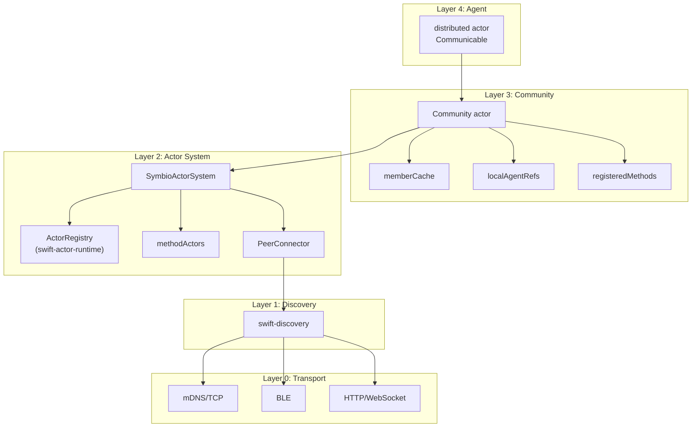
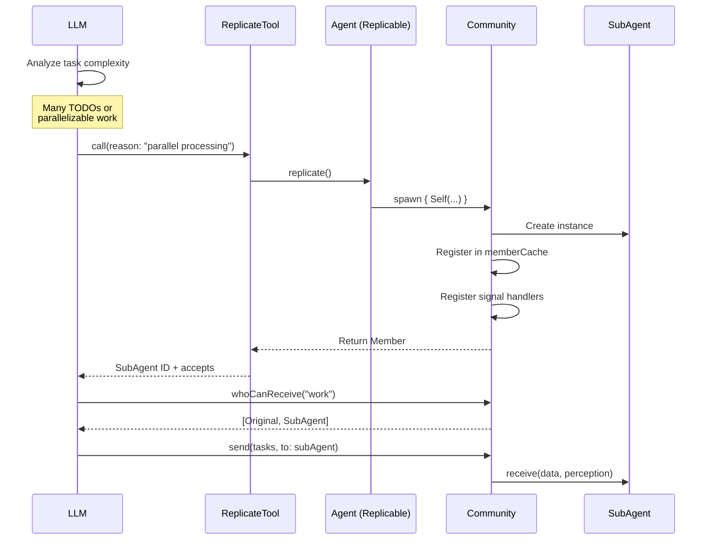

# SwiftAgent

[](https://deepwiki.com/1amageek/SwiftAgent)

SwiftAgent is a powerful Swift framework for building AI agents using a declarative SwiftUI-like syntax. It provides a type-safe, composable way to create complex agent workflows while maintaining Swift's expressiveness.

## Architecture Overview

```mermaid
graph TB
    subgraph "Core Protocol"
        Step["Step&lt;Input, Output&gt;"]
    end

    subgraph "OpenFoundationModels Integration"
        Tool["Tool Protocol"]
        LMS["LanguageModelSession"]
        Generable["@Generable"]
        Prompt["@PromptBuilder"]
        Instructions["@InstructionsBuilder"]
        GenOpts["GenerationOptions"]
    end

    subgraph "Session Management"
        Session["@Session"]
        WithSession["withSession()"]
        SessionContext["SessionContext"]
    end

    subgraph "Agent Session System"
        AgentSession["AgentSession"]
        AgentWrapper["@Agent"]
        WithAgent["withAgent()"]
        AgentConfig["AgentConfiguration"]
        SubagentReg["SubagentRegistry"]
        SubagentDef["SubagentDefinition"]
        Delegate["Delegate Step"]
        SessionStore["SessionStore"]
    end

    subgraph "Built-in Steps"
        subgraph "Transform Steps"
            Transform["Transform"]
            Map["Map"]
            Reduce["Reduce"]
            Join["Join"]
        end

        subgraph "Control Flow"
            Loop["Loop"]
            Parallel["Parallel"]
            Race["Race"]
        end

        subgraph "AI Generation"
            Generate["Generate&lt;T&gt;"]
            GenerateText["GenerateText"]
            Streaming["Streaming Support"]
        end
    end

    subgraph "Monitoring"
        Monitor["Monitor"]
        Tracing["Distributed Tracing"]
    end

    subgraph "Utilities"
        PromptTemplates["PromptTemplates"]
        SystemInfo["SystemInfo"]
        StepAsTool["Step as Tool"]
    end

    subgraph "Tools (AgentTools)"
        ReadTool["ReadTool"]
        WriteTool["WriteTool"]
        EditTool["EditTool"]
        GrepTool["GrepTool"]
        GlobTool["GlobTool"]
        GitTool["GitTool"]
        ExecuteCommandTool["ExecuteCommandTool"]
        URLFetchTool["URLFetchTool"]
    end

    subgraph "MCP Integration (SwiftAgentMCP)"
        MCPClient["MCPClient"]
        MCPDynamicTool["MCPDynamicTool"]
    end

    subgraph "Skills System"
        SkillRegistry["SkillRegistry"]
        SkillLoader["SkillLoader"]
        SkillDiscovery["SkillDiscovery"]
        SkillTool["SkillTool"]
        SkillsConfig["SkillsConfiguration"]
    end

    subgraph "Distributed Agents (SwiftAgentSymbio)"
        Community["Community"]
        SymbioActorSystem["SymbioActorSystem"]
        Communicable["Communicable"]
        Replicable["Replicable"]
        Member["Member"]
        PeerConnector["PeerConnector"]
    end

    Step --> Transform
    Step --> Map
    Step --> Loop
    Step --> Parallel
    Step --> Race
    Step --> Generate
    Step --> GenerateText
    Step --> Delegate

    Session --> SessionContext
    WithSession --> SessionContext
    SessionContext --> LMS

    AgentWrapper --> AgentSession
    WithAgent --> AgentSession
    AgentSession --> AgentConfig
    AgentSession --> SubagentReg
    SubagentReg --> SubagentDef
    Delegate --> SubagentReg
    AgentSession --> SessionStore

    Generate --> LMS
    Generate --> Streaming
    GenerateText --> LMS
    GenerateText --> Streaming
    Generate --> GenOpts
    GenerateText --> GenOpts

    StepAsTool --> Tool
    Tool --> ReadTool
    Tool --> WriteTool
    Tool --> EditTool
    Tool --> ExecuteCommandTool

    MCPClient --> MCPDynamicTool
    MCPDynamicTool --> Tool

    AgentSession --> SkillRegistry
    SkillRegistry --> SkillLoader
    SkillDiscovery --> SkillLoader
    SkillTool --> SkillRegistry
    AgentConfig --> SkillsConfig
    SkillsConfig --> SkillRegistry

    Community --> SymbioActorSystem
    Community --> Member
    Communicable --> Community
    Communicable -.-> Replicable
    SymbioActorSystem --> PeerConnector
```



## Features

- **Declarative Syntax**: Build agents using familiar SwiftUI-like syntax
- **Composable Steps**: Chain multiple steps together seamlessly with StepBuilder
- **Type-Safe Tools**: Define and use tools with compile-time type checking
- **Model-Agnostic**: Works with any AI model through OpenFoundationModels
- **Modular Design**: Create reusable agent components
- **Async/Await Support**: Built for modern Swift concurrency
- **Protocol-Based**: Flexible and extensible architecture
- **@Session**: TaskLocal-based session management with property wrapper
- **Builder APIs**: Dynamic Instructions and Prompt construction with result builders
- **Streaming**: Real-time streaming support for both text and structured output generation
- **GenerationOptions**: Fine-grained control over sampling, temperature, and token limits
- **Monitoring**: Built-in monitoring and distributed tracing support
- **OpenTelemetry**: Industry-standard distributed tracing with swift-distributed-tracing
- **MCP Integration**: Optional Model Context Protocol support via SwiftAgentMCP
- **Chain Support**: Chain up to 8 steps with type-safe composition
- **Step as Tool**: Use Steps directly as Tools with automatic schema generation
- **Agent Session**: High-level agent management with session forking and persistence
- **Subagent Delegation**: Delegate tasks to specialized subagents with circular dependency detection
- **Model Providers**: Flexible model configuration with provider abstraction
- **Agent Skills**: Portable skill packages with auto-discovery and progressive disclosure
- **Distributed Agents**: SwiftAgentSymbio for multi-agent communication using Swift Distributed Actors

## Core Components

### Steps

Steps are the fundamental building blocks in SwiftAgent. They process input and produce output in a type-safe manner:

```swift
public protocol Step<Input, Output> {
    associatedtype Input: Sendable
    associatedtype Output: Sendable

    func run(_ input: Input) async throws -> Output
}
```

## Session Management

SwiftAgent provides elegant session management through TaskLocal-based `@Session` property wrapper, similar to SwiftUI's `@Environment`. This enables session propagation through the Step hierarchy without manual parameter passing.

### @Session Property Wrapper

The `@Session` wrapper provides access to the current `LanguageModelSession` from the task context:

```swift
struct TranslateStep: Step {
    @Session var session: LanguageModelSession

    func run(_ input: String) async throws -> String {
        let response = try await session.respond {
            Prompt("Translate to Japanese: \(input)")
        }
        return response.content
    }
}
```

### withSession - Setting the Context

Use `withSession` to provide a session to the Step hierarchy:

```swift
let session = LanguageModelSession(model: myModel) {
    Instructions("You are a helpful translator")
}

let result = try await withSession(session) {
    try await TranslateStep().run("Hello, world!")
}
```

### Convenient Run with Session

You can also use the Step extension for a more concise syntax:

```swift
let result = try await TranslateStep().run("Hello", session: session)
```

### Nested Steps

Sessions automatically propagate through nested Steps:

```swift
struct OuterStep: Step {
    @Session var session: LanguageModelSession

    func run(_ input: String) async throws -> String {
        // InnerStep automatically gets the same session
        let processed = try await InnerStep().run(input)

        let response = try await session.respond {
            Prompt("Summarize: \(processed)")
        }
        return response.content
    }
}

struct InnerStep: Step {
    @Session var session: LanguageModelSession

    func run(_ input: String) async throws -> String {
        let response = try await session.respond {
            Prompt("Expand: \(input)")
        }
        return response.content
    }
}

// One withSession provides session to all nested Steps
try await withSession(session) {
    try await OuterStep().run("AI")
}
```

## Agent Session System

SwiftAgent provides a high-level agent management system inspired by Claude Agent SDK. This system offers session management, subagent delegation, and persistence capabilities.

### AgentSession

`AgentSession` is the main interface for managing AI agent conversations:

```swift
import SwiftAgent
import OpenFoundationModels

// Create configuration
let config = AgentConfiguration(
    modelProvider: MyModelProvider(),
    tools: .default,
    instructions: Instructions {
        "You are a helpful coding assistant"
        "Use available tools to help users"
    }
)

// Create session
let session = try await AgentSession.create(configuration: config)

// Send prompts
let response = try await session.prompt("Hello!")
print(response.content)

// Stream responses
let stream = session.stream("Write a function...")
for try await snapshot in stream {
    print(snapshot.content)
}
```

### @Agent Property Wrapper

Similar to `@Session`, the `@Agent` property wrapper provides access to the current `AgentSession` from the task context:

```swift
struct MyStep: Step {
    @Agent var agent: AgentSession

    func run(_ input: String) async throws -> String {
        let response = try await agent.prompt(input)
        return response.content
    }
}

// Usage
try await withAgent(session) {
    try await MyStep().run("Hello")
}
```

### Model Providers

Abstract model loading with the `ModelProvider` protocol:

```swift
struct OpenAIProvider: ModelProvider {
    let apiKey: String

    func provideModel() async throws -> any LanguageModel {
        // Return your model implementation
        OpenAIModel(apiKey: apiKey)
    }
}

// Use in configuration
let config = AgentConfiguration(
    modelProvider: OpenAIProvider(apiKey: "your-api-key"),
    tools: .default,
    instructions: Instructions("You are helpful")
)
```

### Subagent Delegation

Delegate tasks to specialized subagents:

```swift
// Define subagents
let codeReviewer = SubagentDefinition(
    name: "code-reviewer",
    instructions: Instructions {
        "You are a code review expert"
        "Focus on best practices and potential bugs"
    },
    tools: .only(["file_read", "text_search"])
)

let testWriter = SubagentDefinition(
    name: "test-writer",
    instructions: Instructions("You write comprehensive tests"),
    tools: .only(["file_read", "file_write"])
)

// Create configuration with subagents
let config = AgentConfiguration(
    modelProvider: myProvider,
    tools: .default,
    instructions: Instructions("You are a coding assistant"),
    subagents: [codeReviewer, testWriter]
)

let session = try await AgentSession.create(configuration: config)

// Invoke subagent directly
let review = try await session.invokeSubagent(
    "code-reviewer",
    prompt: "Review this code: ..."
)
```

### Delegate Step

Use the `Delegate` step to integrate subagent delegation into Step chains:

```swift
struct CodeReviewPipeline: Step {
    let modelProvider: any ModelProvider

    var body: some Step<String, String> {
        // First, review the code
        Delegate(
            to: .codeReviewer(),
            modelProvider: modelProvider
        ) { code in
            Prompt("Review this code:\n\n\(code)")
        }
    }

    func run(_ input: String) async throws -> String {
        try await body.run(input)
    }
}

// Factory methods for common subagents
let review = Delegate<String, String>.codeReview(modelProvider: myProvider)
let tests = Delegate<String, String>.writeTests(modelProvider: myProvider)
let docs = Delegate<String, String>.writeDocumentation(modelProvider: myProvider)
```

### SubagentRegistry

Manage multiple subagents with `SubagentRegistry`:

```swift
// Build registry with result builder
let registry = SubagentRegistry.build {
    SubagentDefinition.codeReviewer()
    SubagentDefinition.testWriter()
    SubagentDefinition.documentationWriter()
}

// Or register dynamically
let registry = SubagentRegistry()
await registry.register(.codeReviewer())
await registry.register(.testWriter())

// List available subagents
let names = await registry.registeredNames
// ["code-reviewer", "documentation-writer", "test-writer"]
```

### Session Persistence

Save and resume sessions:

```swift
// Create with auto-save
let store = FileSessionStore(directory: URL(fileURLWithPath: "~/.myagent/sessions"))

let config = AgentConfiguration(
    modelProvider: myProvider,
    tools: .default,
    instructions: Instructions("You are helpful"),
    sessionStore: store,
    autoSave: true
)

let session = try await AgentSession.create(configuration: config)

// Manual save
try await session.save(to: store)

// Resume later
let resumed = try await AgentSession.resume(
    id: session.id,
    from: store,
    configuration: config
)
```

### Session Forking

Create branches from existing sessions:

```swift
let session = try await AgentSession.create(configuration: config)

// Have a conversation
_ = try await session.prompt("Let's discuss Swift concurrency")
_ = try await session.prompt("What about actors?")

// Fork to explore a different direction
let forked = try await session.fork()

// Original continues one way
_ = try await session.prompt("Tell me about async/await")

// Fork explores another
_ = try await forked.prompt("Tell me about structured concurrency")
```

### Tool Configuration

Configure which tools are available:

```swift
// All default tools
let config1 = AgentConfiguration(
    modelProvider: myProvider,
    tools: .default,
    instructions: Instructions("...")
)

// Only specific tools
let config2 = AgentConfiguration(
    modelProvider: myProvider,
    tools: .only(["file_read", "file_write", "text_search"]),
    instructions: Instructions("...")
)

// Exclude certain tools
let config3 = AgentConfiguration(
    modelProvider: myProvider,
    tools: .except(["command_execute", "git_command"]),
    instructions: Instructions("...")
)
```

### AgentResponse

Responses include rich metadata:

```swift
let response = try await session.prompt("Analyze this code")

// Content
print(response.content)

// Tool calls made during generation
for toolCall in response.toolCalls {
    print("Tool: \(toolCall.toolName)")
    print("Arguments: \(toolCall.arguments)")
    print("Output: \(toolCall.output)")
    print("Success: \(toolCall.success)")
}

// Duration
print("Took: \(response.duration)")

// Raw transcript entries
for entry in response.transcriptEntries {
    // Process transcript
}
```

## AI Model Integration

SwiftAgent uses OpenFoundationModels for AI model integration, providing a unified interface for multiple AI providers:

### Dynamic Instructions with InstructionsBuilder

```swift
let session = LanguageModelSession(model: myModel) {
    Instructions {
        "You are an AI assistant"

        if userPreferences.verbose {
            "Provide detailed explanations"
        }

        for expertise in userExpertiseAreas {
            "You have expertise in \(expertise)"
        }

        "Always be helpful and accurate"
    }
}
```

### Dynamic Prompts with PromptBuilder

```swift
GenerateText(session: session) { input in
    Prompt {
        "User request: \(input)"

        if includeContext {
            "Context: \(contextInfo)"
        }

        for example in relevantExamples {
            "Example: \(example)"
        }

        "Please provide a comprehensive response"
    }
}
```

### Using Model Providers

SwiftAgent works with any AI provider through OpenFoundationModels:

```swift
import SwiftAgent
import OpenFoundationModels

let session = LanguageModelSession(
    model: YourModelFactory.create(apiKey: "your-api-key")
) {
    Instructions("You are a helpful assistant.")
}
```

### Available Provider Packages

SwiftAgent is provider-agnostic. Choose from available OpenFoundationModels provider packages:

- [OpenFoundationModels-OpenAI](https://github.com/1amageek/OpenFoundationModels-OpenAI) - OpenAI models (GPT-4o, etc.)
- [OpenFoundationModels-Ollama](https://github.com/1amageek/OpenFoundationModels-Ollama) - Local models via Ollama
- [OpenFoundationModels-Anthropic](https://github.com/1amageek/OpenFoundationModels-Anthropic) - Anthropic Claude models

## Built-in Steps

### Transform

Convert data from one type to another:

```swift
Transform<String, Int> { input in
    Int(input) ?? 0
}
```

### Generate

Generate structured output using AI models:

```swift
@Generable
struct Story {
    @Guide(description: "The story title")
    let title: String
    @Guide(description: "The story content")
    let content: String
}

struct StoryGenerator: Step {
    @Session var session: LanguageModelSession

    func run(_ topic: String) async throws -> Story {
        let generate = Generate<String, Story>(session: session) { input in
            Prompt {
                "Write a story about: \(input)"
                "Include vivid descriptions"
            }
        }
        return try await generate.run(topic)
    }
}

// Usage
let story = try await withSession(session) {
    try await StoryGenerator().run("a brave knight")
}
```

### GenerateText

Generate string output using AI models:

```swift
struct TextGenerator: Step {
    @Session var session: LanguageModelSession

    func run(_ topic: String) async throws -> String {
        let generate = GenerateText<String>(session: session) { input in
            Prompt("Write about: \(input)")
        }
        return try await generate.run(topic)
    }
}
```

### PromptRepresentable Input

When your input type conforms to `PromptRepresentable`, you can omit the prompt builder:

```swift
struct UserQuery: PromptRepresentable {
    let question: String
    let context: String

    var promptRepresentation: Prompt {
        Prompt {
            "Context: \(context)"
            "Question: \(question)"
        }
    }
}

// No prompt builder needed
let step = GenerateText<UserQuery>(session: session)
let answer = try await step.run(UserQuery(
    question: "What is Swift?",
    context: "Programming languages"
))
```

### Loop

Iterate with a condition:

```swift
Loop(max: 5) { input in
    ProcessingStep()
} until: { output in
    output.meetsQualityCriteria
}
```

### Map

Process collections:

```swift
Map<[String], [Int]> { item, index in
    Transform { str in
        str.count
    }
}
```

### Parallel

Execute steps concurrently:

```swift
Parallel<String, Int> {
    CountWordsStep()
    CountCharactersStep()
    CountLinesStep()
}
```

### Race

Execute steps concurrently and return the first successful result:

```swift
// Without timeout
Race<String, String> {
    FastAPIStep()
    SlowAPIStep()
}

// With timeout
Race<String, String>(timeout: .seconds(5)) {
    APIStep1()
    APIStep2()
    FallbackStep()
}
```

### Reduce

Combine collection elements into a single value:

```swift
Reduce<[Metric], Summary>(initial: Summary()) { summary, metric, index in
    Transform { current in
        current.adding(metric, at: index)
    }
}
```

### Delegate

Delegate work to specialized subagents (see [Agent Session System](#agent-session-system) for details):

```swift
Delegate(
    to: .codeReviewer(),
    modelProvider: myProvider
) { code in
    Prompt("Review this code:\n\n\(code)")
}
```

## Built-in Tools

SwiftAgent includes a comprehensive suite of tools for file operations, searching, command execution, and more.

| Tool Name | Purpose |
|-----------|---------|
| **ReadTool** | Read file contents with line numbers |
| **WriteTool** | Write content to files |
| **EditTool** | Find and replace text in files |
| **MultiEditTool** | Apply multiple edits in one transaction |
| **GrepTool** | Search file contents using regex |
| **GlobTool** | Find files using glob patterns |
| **ExecuteCommandTool** | Execute shell commands |
| **GitTool** | Perform Git operations |
| **URLFetchTool** | Fetch content from URLs |

### Tool Integration with AI Models

```swift
let session = LanguageModelSession(
    model: myModel,
    tools: [
        ReadTool(),
        WriteTool(),
        EditTool(),
        GrepTool(),
        ExecuteCommandTool()
    ]
) {
    Instructions("You are a code assistant with file system access.")
}
```

## SwiftAgentMCP

SwiftAgentMCP provides optional MCP (Model Context Protocol) integration for SwiftAgent, enabling use of tools from MCP servers.

### Installation

Add SwiftAgentMCP to your dependencies:

```swift
.target(
    name: "MyApp",
    dependencies: [
        .product(name: "SwiftAgent", package: "SwiftAgent"),
        .product(name: "SwiftAgentMCP", package: "SwiftAgent")
    ]
)
```

### Usage

```swift
import SwiftAgent
import SwiftAgentMCP
import OpenFoundationModels

// 1. Configure the MCP server
let config = MCPServerConfig(
    name: "filesystem",
    transport: .stdio(
        command: "/usr/local/bin/npx",
        arguments: ["-y", "@modelcontextprotocol/server-filesystem", "/path/to/dir"]
    )
)

// 2. Connect to the MCP server
let mcpClient = try await MCPClient.connect(config: config)
defer { Task { await mcpClient.disconnect() } }

// 3. Get tools from the MCP server (OpenFoundationModels.Tool compatible)
let mcpTools = try await mcpClient.tools()

// 4. Use with LanguageModelSession
let session = LanguageModelSession(
    model: myModel,
    tools: mcpTools
) {
    Instructions("You are a helpful assistant with file system access")
}

// 5. Use in your Steps
try await withSession(session) {
    try await MyFileStep().run("List all Swift files")
}
```

### MCP Resources and Prompts

```swift
// Read resources from MCP servers
let resources = try await mcpClient.listResources()
let content = try await mcpClient.resourceAsText(uri: "file:///path/to/file.txt")

// Fetch prompts from MCP servers
let prompts = try await mcpClient.listPrompts()
let (description, messages) = try await mcpClient.getPrompt(
    name: "code_review",
    arguments: ["language": "swift"]
)
```

## SwiftAgentSymbio

SwiftAgentSymbio provides distributed agent communication and discovery using Swift Distributed Actors. It enables agents to find each other, exchange signals, and work together across process and network boundaries.

### Architecture



### Installation

```swift
.target(
    name: "MyApp",
    dependencies: [
        .product(name: "SwiftAgent", package: "SwiftAgent"),
        .product(name: "SwiftAgentSymbio", package: "SwiftAgent")
    ]
)
```

### Core Concepts

| Concept | Description |
|---------|-------------|
| **Community** | Manages agents and their communication |
| **Member** | Represents an agent in the community |
| **Communicable** | Protocol for agents that can communicate (community + perceptions + receive) |
| **Replicable** | Protocol for agents that can replicate themselves |
| **Perception** | Signal types an agent can receive (accepts) |
| **Capability** | Services an agent provides (provides) - remote only |

### Design Principles

- **perceptions (accepts)**: Signal types an agent can receive. Works for both local and remote agents.
- **capabilities (provides)**: Remote service advertisement. Local agents have `provides: []`.
- **Location transparency**: Agents don't know if targets are local or remote.
- **changes stream**: Single consumer only (AsyncStream limitation).

### Defining an Agent

```swift
import SwiftAgentSymbio

// Define a perception
struct WorkPerception: Perception {
    let identifier = "work"
    typealias Signal = WorkSignal
}

struct WorkSignal: Sendable, Codable {
    let task: String
}

// Define an agent
distributed actor WorkerAgent: Communicable, Terminatable {
    typealias ActorSystem = SymbioActorSystem

    let community: Community

    nonisolated var perceptions: [any Perception] {
        [WorkPerception()]
    }

    init(community: Community, actorSystem: SymbioActorSystem) {
        self.community = community
        self.actorSystem = actorSystem
    }

    distributed func receive(_ data: Data, perception: String) async throws -> Data? {
        let signal = try JSONDecoder().decode(WorkSignal.self, from: data)
        print("Received work: \(signal.task)")
        return nil
    }

    nonisolated func terminate() async {
        print("Worker shutting down")
    }
}
```

### Using Community

```swift
// Create actor system and community
let actorSystem = SymbioActorSystem()
let community = Community(actorSystem: actorSystem)

// Spawn an agent
let worker = try await community.spawn {
    WorkerAgent(community: community, actorSystem: actorSystem)
}

// Find agents that can receive "work" signals
let workers = await community.whoCanReceive("work")

// Send a signal
try await community.send(
    WorkSignal(task: "process data"),
    to: worker,
    perception: "work"
)

// Monitor community changes (single consumer only)
Task {
    for await change in await community.changes {
        switch change {
        case .joined(let member):
            print("Agent joined: \(member.id)")
        case .left(let member):
            print("Agent left: \(member.id)")
        default:
            break
        }
    }
}

// Terminate an agent
try await community.terminate(worker)
```

### Internal Data Flows

#### spawn() Flow

```
factory() → actorReady() → ActorRegistry.register()
    → localAgentRefs[id] = agent
    → registerMethod("agent.perception.work")
    → memberCache[id] = Member
    → yield(.joined)
```

#### terminate() Flow

```
Terminatable.terminate()
    → unregisterMethod()
    → resignID() → ActorRegistry.unregister()
    → remove from localAgentRefs, memberCache
    → yield(.left)
```

#### send() Local Flow

```
localAgentIDs.contains(id)?
    → cast to Communicable
    → agent.receive(data, perception)
```

#### send() Remote Flow

```
PeerConnector.invoke(capability, peerID, data)
    → Transport → Remote Peer
```

### Operation Support

| Operation | Local | Remote |
|-----------|:-----:|:------:|
| spawn | ✅ | ❌ |
| terminate | ✅ | ❌ |
| send | ✅ | ✅ |
| discover | ✅ | ✅ |
| invoke (capability) | ❌ | ✅ |

### Protocols

```swift
// Agent that can communicate within a community
public protocol Communicable: DistributedActor
    where ActorSystem == SymbioActorSystem {
    var community: Community { get }
    nonisolated var perceptions: [any Perception] { get }
    distributed func receive(_ data: Data, perception: String) async throws -> Data?
}

// Agent that can be gracefully terminated
public protocol Terminatable: Actor {
    nonisolated func terminate() async
}

// Agent that can replicate itself
public protocol Replicable: Sendable {
    func replicate() async throws -> Member
}
```

### Internal Structures

#### Community Storage

```swift
actor Community {
    var memberCache: [String: Member]              // All members (local + remote)
    var localAgentIDs: Set<String>                 // Local distributed actor agent IDs
    var localAgentRefs: [String: any DistributedActor]  // Strong references to local agents
    var registeredMethods: [String: [String]]      // agentID → method names
}
```

#### SymbioActorSystem Storage

```swift
final class SymbioActorSystem: DistributedActorSystem {
    let actorRegistry: ActorRuntime.ActorRegistry  // swift-actor-runtime
    let methodActors: Mutex<[String: Address]>     // method → ActorID
    var peerConnector: PeerConnector?              // Remote communication
}
```

### SubAgent Spawning via Tools

LLM can dynamically spawn SubAgents when it determines tasks require parallelization. SubAgents are automatically detected by Community and become available as dynamic tools.

#### Flow



#### Implementing Replicable Agent

```swift
distributed actor WorkerAgent: Communicable, Replicable {
    let community: Community

    nonisolated var perceptions: [any Perception] {
        [WorkPerception()]
    }

    // Required by Replicable protocol
    func replicate() async throws -> Member {
        try await community.spawn {
            WorkerAgent(community: self.community, actorSystem: self.actorSystem)
        }
    }

    distributed func receive(_ data: Data, perception: String) async throws -> Data? {
        // Handle work...
    }
}
```

#### Using ReplicateTool with LLM

```swift
distributed actor WorkerAgent: Communicable, Replicable {
    let community: Community

    // Expose tool for LLM to spawn SubAgents
    var replicateTool: ReplicateTool {
        ReplicateTool(agent: self)
    }

    func replicate() async throws -> Member {
        try await community.spawn {
            WorkerAgent(community: self.community, actorSystem: self.actorSystem)
        }
    }
}

// Add to LanguageModelSession
let session = LanguageModelSession(
    model: model,
    tools: [agent.replicateTool, otherTools...]
) {
    Instructions {
        "You can spawn helper agents when tasks are complex."
        "Use replicate_agent when you have many TODOs or parallelizable work."
        "After spawning, use community signals to distribute work."
    }
}
```

#### LLM Decision Flow

The LLM autonomously decides when to spawn SubAgents:

```
1. LLM receives complex task
2. LLM analyzes:
   - Number of independent TODOs
   - Potential for parallel execution
   - Task complexity
3. If parallelization beneficial:
   - Call replicate_agent tool
   - Receive new SubAgent ID
4. Query community for available workers:
   - whoCanReceive("work") → [agents...]
5. Distribute work across agents:
   - send(task1, to: agent1)
   - send(task2, to: agent2)
6. Collect results
```

#### Protocols

```swift
// Agent that can replicate itself (independent of Communicable)
public protocol Replicable: Sendable {
    func replicate() async throws -> Member
}

// Tool for LLM to spawn SubAgents
public struct ReplicateTool: Tool {
    public init(agent: any Replicable)

    // LLM calls this to spawn a SubAgent
    public func call(arguments: ReplicateArguments) async throws -> ReplicateOutput
}
```

### Dependencies

SwiftAgentSymbio depends on:
- `swift-actor-runtime`: ActorRegistry, InvocationEncoder/Decoder, ResultHandler
- `swift-discovery`: PeerConnector, Transport, CapabilityID

## Agent Skills

Agent Skills are portable skill packages that extend agent capabilities. They follow an open specification using SKILL.md files with YAML frontmatter.

### Skill Directory Structure

```
~/.agent/skills/
└── pdf-processing/
    ├── SKILL.md          # Required: metadata + instructions
    ├── scripts/          # Optional: executable scripts
    ├── references/       # Optional: reference documents
    └── assets/           # Optional: images and other assets
```

### SKILL.md Format

```markdown
---
name: pdf-processing
description: Extract text and tables from PDF files.
license: MIT
compatibility: Requires poppler
metadata:
  author: example-org
  version: "1.0"
allowed-tools: Bash(pdftotext:*) Read
---

# PDF Processing Skill

Instructions for the agent on how to process PDFs...
```

### Discovery Paths

Skills are automatically discovered from:

1. `~/.agent/skills/` - User-level skills
2. `./.agent/skills/` - Project-level skills
3. `$AGENT_SKILLS_PATH` - Environment variable paths

### Enabling Skills

```swift
// Enable auto-discovery
let config = AgentConfiguration(
    modelProvider: myProvider,
    instructions: Instructions("You are a helpful assistant"),
    skills: .autoDiscover()
)

// With additional search paths
let config = AgentConfiguration(
    modelProvider: myProvider,
    instructions: Instructions("You are a helpful assistant"),
    skills: .autoDiscover(additionalPaths: ["/custom/skills/path"])
)

// Using a custom registry
let registry = SkillRegistry()
let skill = try SkillLoader.loadMetadata(from: "~/.agent/skills/pdf-processing")
await registry.register(skill)

let config = AgentConfiguration(
    modelProvider: myProvider,
    instructions: Instructions("You are a helpful assistant"),
    skills: .custom(registry: registry)
)
```

### Using Skills in AgentSession

```swift
let session = try await AgentSession.create(configuration: config)

// List available skills
let skills = await session.listSkills()
for skill in skills {
    print("\(skill.metadata.name): \(skill.metadata.description)")
}

// Skills are automatically presented to the LLM
// The LLM can activate skills using the activate_skill tool
let response = try await session.prompt("Process this PDF file")
```

### Progressive Disclosure Model

Skills use a three-phase progressive disclosure model:

1. **Discovery**: Only metadata (name, description) is loaded initially
2. **Activation**: LLM calls `activate_skill` to load full instructions
3. **Execution**: Agent follows skill instructions to complete the task

This minimizes context usage while allowing rich, detailed skill instructions.

### Prompt Injection

When skills are enabled, an `<available_skills>` XML block is injected into the system prompt:

```xml
<available_skills>
<skill name="pdf-processing" location="~/.agent/skills/pdf-processing">
Extract text and tables from PDF files.
</skill>
</available_skills>
```

## Examples

### Simple Translation Step

```swift
import SwiftAgent
import OpenFoundationModels

struct Translator: Step {
    @Session var session: LanguageModelSession

    func run(_ text: String) async throws -> String {
        let generate = GenerateText<String>(session: session) { input in
            Prompt("Translate to Japanese: \(input)")
        }
        return try await generate.run(text)
    }
}

// Usage
let session = LanguageModelSession(model: myModel) {
    Instructions("You are a professional translator")
}

let result = try await withSession(session) {
    try await Translator().run("Hello, world!")
}
```

### Code Analysis with Tools

```swift
struct CodeAnalyzer: Step {
    @Session var session: LanguageModelSession

    func run(_ request: String) async throws -> AnalysisResult {
        let generate = Generate<String, AnalysisResult>(session: session) { input in
            Prompt {
                "Analyze the following: \(input)"
                "Use available tools to examine the code"
                "Provide actionable recommendations"
            }
        }
        return try await generate.run(request)
    }
}

@Generable
struct AnalysisResult {
    @Guide(description: "Summary of findings")
    let summary: String

    @Guide(description: "List of issues found")
    let issues: String

    @Guide(description: "Recommendations")
    let recommendations: String
}

// Usage with tools
let session = LanguageModelSession(
    model: myModel,
    tools: [ReadTool(), GrepTool(), GitTool()]
) {
    Instructions {
        "You are a code analysis expert"
        "Analyze the codebase and provide insights"
    }
}

let result = try await withSession(session) {
    try await CodeAnalyzer().run("Review the authentication module")
}
```

### Multi-Step Pipeline

```swift
struct ContentPipeline: Step {
    @Session var session: LanguageModelSession

    @StepBuilder
    var body: some Step<String, String> {
        // Step 1: Clean input
        Transform { $0.trimmingCharacters(in: .whitespaces) }

        // Step 2: Generate content
        GenerateText(session: session) { input in
            Prompt("Expand this topic: \(input)")
        }

        // Step 3: Format output
        Transform { "## Content\n\n\($0)" }
    }

    func run(_ input: String) async throws -> String {
        try await body.run(input)
    }
}

// Usage
try await withSession(session) {
    try await ContentPipeline().run("Swift Concurrency")
}
```

## Requirements

- Swift 6.2+
- iOS 18.0+ / macOS 15.0+
- Xcode 16.0+

## Installation

### Swift Package Manager

```swift
dependencies: [
    .package(url: "https://github.com/1amageek/SwiftAgent.git", branch: "main")
]
```

### Target Dependencies

```swift
.target(
    name: "MyApp",
    dependencies: [
        .product(name: "SwiftAgent", package: "SwiftAgent"),
        .product(name: "AgentTools", package: "SwiftAgent"),      // Optional: built-in tools
        .product(name: "SwiftAgentMCP", package: "SwiftAgent")    // Optional: MCP integration
    ]
)
```

## Getting Started

### 1. Add SwiftAgent to your Package.swift

```swift
import PackageDescription

let package = Package(
    name: "MyAgentApp",
    platforms: [.iOS(.v18), .macOS(.v15)],
    dependencies: [
        .package(url: "https://github.com/1amageek/SwiftAgent.git", branch: "main"),
        // Add your chosen AI provider package
        .package(url: "https://github.com/1amageek/OpenFoundationModels-OpenAI.git", branch: "main")
    ],
    targets: [
        .target(
            name: "MyAgentApp",
            dependencies: [
                .product(name: "SwiftAgent", package: "SwiftAgent"),
                .product(name: "AgentTools", package: "SwiftAgent"),
                .product(name: "OpenFoundationModelsOpenAI", package: "OpenFoundationModels-OpenAI")
            ]
        )
    ]
)
```

### 2. Create your first Step

```swift
import SwiftAgent
import OpenFoundationModels

struct MyAssistant: Step {
    @Session var session: LanguageModelSession

    func run(_ input: String) async throws -> String {
        let generate = GenerateText<String>(session: session) { request in
            Prompt {
                "User request: \(request)"
                "Provide a helpful response"
            }
        }
        return try await generate.run(input)
    }
}
```

### 3. Run your Step

```swift
@main
struct MyApp {
    static func main() async throws {
        let session = LanguageModelSession(
            model: OpenAIModelFactory.gpt4o(apiKey: ProcessInfo.processInfo.environment["OPENAI_API_KEY"] ?? "")
        ) {
            Instructions {
                "You are a helpful assistant"
                "Be concise and informative"
            }
        }

        let result = try await withSession(session) {
            try await MyAssistant().run("Hello, world!")
        }
        print(result)
    }
}
```

## Advanced Features

### Monitoring & Tracing

#### Monitor - Lightweight Debugging

```swift
GenerateText(session: session) { input in
    Prompt("Process: \(input)")
}
.onInput { input in
    print("Starting with: \(input)")
}
.onOutput { output in
    print("Generated: \(output)")
}
.onError { error in
    print("Failed: \(error)")
}
```

#### Distributed Tracing - Production Monitoring

```swift
GenerateText(session: session) { input in
    Prompt("Process: \(input)")
}
.trace("TextGeneration", kind: .client)
```

### Streaming Support

SwiftAgent supports streaming for both `Generate` and `GenerateText` steps, allowing you to process output as it's generated.

#### Streaming with GenerateText

```swift
var previousContent = ""
let step = GenerateText<String>(
    session: session,
    prompt: { input in
        Prompt("Generate a story about: \(input)")
    },
    onStream: { snapshot in
        // snapshot.content is the accumulated string
        let accumulated = snapshot.content

        // Calculate new chunk
        let chunk = String(accumulated.dropFirst(previousContent.count))
        previousContent = accumulated

        print(chunk, terminator: "")

        // Check completion via rawContent
        if snapshot.rawContent.isComplete {
            print("\n[Generation complete]")
        }
    }
)
let fullStory = try await step.run("a brave knight")
```

#### Streaming with Structured Output

```swift
@Generable
struct BlogPost: Sendable {
    @Guide(description: "The title")
    let title: String
    @Guide(description: "The content")
    let content: String
}

let step = Generate<String, BlogPost>(
    session: session,
    prompt: { input in
        Prompt("Write a blog post about: \(input)")
    },
    onStream: { snapshot in
        // snapshot.content is BlogPost.PartiallyGenerated
        // Properties are Optional in PartiallyGenerated
        let partialPost = snapshot.content

        if let title = partialPost.title {
            print("Title: \(title)")
        }
        if let content = partialPost.content {
            print("Content preview: \(content.prefix(100))...")
        }
    }
)
let finalPost = try await step.run("Swift Concurrency")
```

### Generation Options

Control output generation with `GenerationOptions`:

```swift
let step = GenerateText<String>(
    session: session,
    options: GenerationOptions(
        sampling: .random(probabilityThreshold: 0.95),
        temperature: 0.7,
        maximumResponseTokens: 2000
    )
) { input in
    Prompt("Write a creative story about: \(input)")
}

// For more deterministic output
let deterministicStep = Generate<String, Analysis>(
    session: session,
    options: GenerationOptions(
        sampling: .greedy,
        temperature: 0.3,
        maximumResponseTokens: 500
    )
) { input in
    Prompt("Analyze: \(input)")
}
```

### Step as Tool

Steps can be used directly as Tools when they conform to the appropriate protocols. This enables seamless integration between Steps and the tool system.

```swift
@Generable
struct TextInput: Sendable {
    @Guide(description: "The text to process")
    let text: String
}

struct TextOutput: Sendable, PromptRepresentable {
    let result: String

    var promptRepresentation: Prompt {
        Prompt(result)
    }
}

struct UppercaseStep: Step, Tool, Sendable {
    let name = "uppercase"
    let description = "Converts text to uppercase"

    func run(_ input: TextInput) async throws -> TextOutput {
        TextOutput(result: input.text.uppercased())
    }
}

// Use as a Tool in LanguageModelSession
let session = LanguageModelSession(
    model: myModel,
    tools: [UppercaseStep()]
) {
    Instructions("You can convert text to uppercase")
}
```

## License

SwiftAgent is available under the MIT license.

## Author

@1amageek
