# SwiftAgent

[](https://deepwiki.com/1amageek/SwiftAgent)

SwiftAgent is a powerful Swift framework for building AI agents using a declarative SwiftUI-like syntax. It provides a type-safe, composable way to create complex agent workflows while maintaining Swift's expressiveness.

## Architecture Overview

```mermaid
graph TB
    subgraph "Core Protocols"
        Step["Step<Input, Output>"]
        Agent["Agent: Step"]
        
        Step --> Agent
    end
    
    subgraph "OpenFoundationModels Integration"
        Tool["Tool Protocol"]
        LMS["LanguageModelSession"]
        Generable["@Generable"]
    end
    
    subgraph "Built-in Steps"
        subgraph "Transform Steps"
            Transform["Transform"]
            Map["Map"]
            Reduce["Reduce"]
            Join["Join"]
        end
        
        subgraph "Control Flow"
            Loop["Loop"]
            Parallel["Parallel"]
            Race["Race"]
        end
        
        subgraph "AI Generation"
            Generate["Generate<T>"]
            GenerateText["GenerateText"]
        end
    end
    
    subgraph "Safety & Monitoring"
        Guardrails["Guardrails"]
        Monitor["Monitor"]
        TracingStep["TracingStep"]
    end
    
    subgraph "Tools"
        FST["FileSystemTool"]
        GT["GitTool"]
        ECT["ExecuteCommandTool"]
        UFT["URLFetchTool"]
    end
    
    Step --> Transform
    Step --> Map
    Step --> Loop
    Step --> Parallel
    Step --> Generate
    Step --> GenerateText
    
    Agent --> Guardrails
    Step --> Monitor
    Step --> TracingStep
    
    Generate --> LMS
    GenerateText --> LMS
    
    Tool --> FST
    Tool --> GT
    Tool --> ECT
    Tool --> UFT
```



## Features

- 🎯 **Declarative Syntax**: Build agents using familiar SwiftUI-like syntax
- 🔄 **Composable Steps**: Chain multiple steps together seamlessly
- 🛠️ **Type-Safe Tools**: Define and use tools with compile-time type checking
- 🤖 **Model-Agnostic**: Works with any AI model through OpenFoundationModels
- 📦 **Modular Design**: Create reusable agent components
- 🔄 **Async/Await Support**: Built for modern Swift concurrency
- 🎭 **Protocol-Based**: Flexible and extensible architecture
- 📊 **State Management**: Memory and Relay for state handling
- 🎨 **@Session**: Elegant session management with property wrapper
- 🏗️ **Builder APIs**: Dynamic Instructions and Prompt construction with result builders
- 🔍 **Monitoring**: Built-in monitoring and distributed tracing support
- 📡 **OpenTelemetry**: Industry-standard distributed tracing with swift-distributed-tracing
- 🏠 **Local AI Support**: Run models completely offline with Ollama integration
- ⚡ **Multiple Providers**: Choose between cloud (OpenAI) or local (Ollama) execution

## Core Components

### Steps

Steps are the fundamental building blocks in SwiftAgent. They process input and produce output in a type-safe manner:

```swift
public protocol Step<Input, Output> {
    associatedtype Input: Sendable
    associatedtype Output: Sendable
    
    func run(_ input: Input) async throws -> Output
}
```

### Agents

Agents are high-level abstractions that combine steps to create complex workflows:

```swift
public protocol Agent: Step {
    associatedtype Body: Step
    
    @StepBuilder var body: Self.Body { get }
    var maxTurns: Int { get }
    var guardrails: [any Guardrail] { get }
}
```

## Session Management

SwiftAgent provides elegant session management through the `@Session` property wrapper, enabling reusable and shared language model sessions across your agents.

### @Session Property Wrapper

The `@Session` wrapper simplifies session creation and management:

```swift
struct MyAgent {
    // Create a session with InstructionsBuilder
    @Session {
        "You are a helpful assistant"
        "Be concise and accurate"
        if debugMode {
            "Include debug information"
        }
    }
    var session
    
    // Or with explicit initialization
    @Session
    var customSession = LanguageModelSession(
        model: OpenAIModelFactory.gpt4o(apiKey: apiKey)
    ) {
        Instructions("You are an expert")
    }
}
```

### Using Sessions with Generate Steps

Pass sessions to Generate steps using the `$` prefix for Relay access:

```swift
struct ContentAgent {
    @Session {
        "You are a content creator"
        "Focus on clarity and engagement"
    }
    var session
    
    var body: some Step {
        GenerateText(session: $session) { input in
            Prompt {
                "Create content about: \(input)"
                if detailed {
                    "Include comprehensive details"
                }
            }
        }
    }
}
```

## AI Model Integration

SwiftAgent uses OpenFoundationModels for AI model integration with powerful Builder APIs:

### Dynamic Instructions with InstructionsBuilder

```swift
// Build instructions dynamically with conditions and loops
let session = LanguageModelSession {
    "You are an AI assistant"
    
    if userPreferences.verbose {
        "Provide detailed explanations"
    }
    
    for expertise in userExpertiseAreas {
        "You have expertise in \(expertise)"
    }
    
    "Always be helpful and accurate"
}
```

### Dynamic Prompts with PromptBuilder

```swift
// Build prompts dynamically
GenerateText(session: $session) { input in
    Prompt {
        "User request: \(input)"
        
        if includeContext {
            "Context: \(contextInfo)"
        }
        
        for example in relevantExamples {
            "Example: \(example)"
        }
        
        "Please provide a comprehensive response"
    }
}
```

### Using Different Model Providers

#### OpenAI
```swift
import SwiftAgent
import OpenFoundationModels
import OpenFoundationModelsOpenAI

// Create a session with OpenAI
@Session
var openAISession = LanguageModelSession(
    model: OpenAIModelFactory.gpt4o(apiKey: "your-api-key")
) {
    Instructions("You are a helpful assistant.")
}
```

#### Ollama (Local Models)
```swift
import SwiftAgent
import OpenFoundationModels
import OpenFoundationModelsOllama

// Create a session with Ollama (runs locally)
@Session
var ollamaSession = LanguageModelSession(
    model: OllamaLanguageModel(modelName: "llama3.2")
) {
    Instructions("You are a helpful assistant.")
}

// Use in a Generate step with PromptBuilder
let step = Generate<String, Story>(session: $openAISession) { input in
    Prompt {
        "Write a story based on: \(input)"
        "Make it engaging and creative"
    }
}
```

### Supported Providers

Currently supported:
- **OpenAI** (GPT-4o, GPT-4o Mini, o1, o3) - ✅ Available now
- **Ollama** (Local models: llama3.2, mistral, deepseek-r1, etc.) - ✅ Available now

Coming soon through OpenFoundationModels:
- **Anthropic** (Claude 3 Opus, Sonnet, Haiku) - 🚧 In development
- **Google** (Gemini Pro, Flash) - 🚧 In development
- **Apple's Foundation Models** (via SystemLanguageModel) - 🚧 In development

## Built-in Steps

### Transform

Convert data from one type to another:

```swift
Transform<String, Int> { input in
    Int(input) ?? 0
}
```

### Generate

Generate structured output using AI models with Builder APIs:

```swift
@Generable
struct Story {
    @Guide(description: "The story title")
    let title: String
    @Guide(description: "The story content")
    let content: String
}

// Using @Session and PromptBuilder
struct StoryGenerator {
    @Session {
        "You are a creative writer"
        "Focus on engaging narratives"
    }
    var session
    
    var generator: some Step {
        Generate<String, Story>(session: $session) { input in
            Prompt {
                "Write a story about: \(input)"
                "Include vivid descriptions"
                if includeDialogue {
                    "Add realistic dialogue"
                }
            }
        }
    }
}
```

### GenerateText

Generate string output using AI models with dynamic builders:

```swift
// Using @Session with shared configuration
struct TextGenerator {
    @Session {
        "You are a creative writer"
        "Use vivid and engaging language"
    }
    var session
    
    func generate(_ topic: String) -> some Step {
        GenerateText(session: $session) { input in
            Prompt {
                "Write about: \(topic)"
                "Input: \(input)"
            }
        }
    }
}
```

### Loop

Iterate with a condition:

```swift
Loop(max: 5) { input in
    ProcessingStep()
} until: { output in
    output.meetsQualityCriteria
}
```

### Map

Process collections:

```swift
Map<[String], [Int]> { item, index in
    Transform { str in
        str.count
    }
}
```

### Parallel

Execute steps concurrently:

```swift
Parallel<String, Int> {
    CountWordsStep()
    CountCharactersStep()
    CountLinesStep()
}
```

## Built-in Tools

SwiftAgent includes a comprehensive suite of tools for file operations, searching, command execution, and more. See the [Tool Reference](#tool-reference) section below for detailed information about each tool.

### Quick Examples

#### File Operations
```swift
// Reading files
let readTool = ReadTool()
let content = try await readTool.call(ReadInput(path: "config.json", startLine: 1, endLine: 50))

// Writing files
let writeTool = WriteTool()
let result = try await writeTool.call(WriteInput(path: "output.txt", content: "Hello, World!"))

// Editing files
let editTool = EditTool()
let edited = try await editTool.call(EditInput(
    path: "main.swift",
    oldString: "print(\"old\")",
    newString: "print(\"new\")",
    replaceAll: "true"
))
```

#### Search Operations
```swift
// Search with grep
let grepTool = GrepTool()
let matches = try await grepTool.call(GrepInput(
    pattern: "TODO:",
    filePattern: "*.swift",
    basePath: "./src",
    ignoreCase: "false",
    contextBefore: 2,
    contextAfter: 2
))

// Find files with glob
let globTool = GlobTool()
let files = try await globTool.call(GlobInput(
    pattern: "**/*.md",
    basePath: ".",
    fileType: "file"
))
```

#### System Operations
```swift
// Execute commands
let executeTool = ExecuteCommandTool()
let output = try await executeTool.call(ExecuteCommandInput(
    command: "swift build",
    timeout: 30
))

// Git operations
let gitTool = GitTool()
let status = try await gitTool.call(GitInput(
    command: "status",
    args: "--short"
))

// Fetch URLs
let urlTool = URLFetchTool()
let webpage = try await urlTool.call(URLInput(url: "https://api.example.com/data"))
```

## Tool Reference

| Tool Name | Purpose | Main Features | Common Use Cases |
|-----------|---------|---------------|------------------|
| **ReadTool** | Read file contents with line numbers | • Line number formatting (123→content)<br>• Range selection (startLine, endLine)<br>• UTF-8 text file support<br>• Max file size: 1MB | • View source code<br>• Read configuration files<br>• Inspect specific line ranges<br>• Debug file contents |
| **WriteTool** | Write content to files | • Create new files or overwrite existing<br>• Automatic parent directory creation<br>• Atomic write operations<br>• UTF-8 encoding only | • Save generated content<br>• Create configuration files<br>• Export data<br>• Write logs or reports |
| **EditTool** | Find and replace text in files | • Single or all occurrences replacement<br>• Preview changes before applying<br>• Atomic operations<br>• Validates old/new strings | • Fix bugs in code<br>• Update configuration values<br>• Refactor variable names<br>• Correct typos |
| **MultiEditTool** | Apply multiple edits in one transaction | • Batch find/replace operations<br>• Transactional (all or nothing)<br>• Order-preserving execution<br>• JSON-based edit specification | • Complex refactoring<br>• Multiple related changes<br>• Atomic updates<br>• Code migrations |
| **GrepTool** | Search file contents using regex | • Regular expression patterns<br>• Case-insensitive option<br>• Context lines (before/after)<br>• Multi-file search | • Find TODO comments<br>• Locate function usage<br>• Search error messages<br>• Code analysis |
| **GlobTool** | Find files using glob patterns | • Wildcard patterns (*, **, ?)<br>• File type filtering<br>• Recursive directory traversal<br>• Sorted results | • Find files by extension<br>• List directory contents<br>• Discover project structure<br>• Batch file operations |
| **ExecuteCommandTool** | Execute shell commands | • Configurable timeout<br>• stdout/stderr capture<br>• Working directory support<br>• Process control | • Build projects<br>• Run tests<br>• System operations<br>• Script execution |
| **GitTool** | Perform Git operations | • All git commands supported<br>• Argument passing<br>• Repository operations<br>• Output capture | • Version control<br>• Commit changes<br>• Branch management<br>• Check status |
| **URLFetchTool** | Fetch content from URLs | • HTTP/HTTPS support<br>• Content type handling<br>• Error handling<br>• Response parsing | • API calls<br>• Web scraping<br>• Data fetching<br>• External integrations |

### Tool Integration with AI Models

All tools implement the `OpenFoundationModels.Tool` protocol and can be used with AI models:

```swift
let session = LanguageModelSession(
    model: OpenAIModelFactory.gpt4o(apiKey: apiKey),
    tools: [
        ReadTool(),
        WriteTool(),
        EditTool(),
        GrepTool(),
        ExecuteCommandTool()
    ]
) {
    Instructions("You are a code assistant with file system access.")
}
```

### Tool Input/Output Types

All tools use `@Generable` structs for type-safe input and provide structured output:

```swift
// Example: ReadTool
@Generable
struct ReadInput {
    @Guide(description: "File path to read")
    let path: String
    @Guide(description: "Starting line number (1-based, 0 for beginning)")
    let startLine: Int
    @Guide(description: "Ending line number (0 for end of file)")
    let endLine: Int
}

// Output includes metadata
struct ReadOutput {
    let content: String        // Formatted with line numbers
    let totalLines: Int       // Total lines in file
    let linesRead: Int        // Lines actually read
    let path: String          // Normalized path
    let startLine: Int        // Actual start line
    let endLine: Int          // Actual end line
}
```

## Examples

### Simple Writer Agent

```swift
import SwiftAgent
import OpenFoundationModels

public struct Writer: Agent {
    public typealias Input = String
    public typealias Output = String
    
    @Session {
        "You are a creative writer"
        "Write compelling stories based on the user's request"
        "Include interesting characters, plot, and theme"
    }
    var session
    
    public init() {}
    
    public var body: some Step<Input, Output> {
        GenerateText(session: $session) { input in
            Prompt {
                "Request: \(input)"
                "Create an engaging narrative"
            }
        }
    }
}

// Usage
let writer = Writer()
let story = try await writer.run("Write a story about a time-traveling scientist")
```

### Local AI Agent with Ollama

```swift
import SwiftAgent
import OpenFoundationModels
import OpenFoundationModelsOllama

public struct LocalAgent: Agent {
    public typealias Input = String
    public typealias Output = String
    
    @Session {
        "You are a helpful assistant running locally"
        "Provide concise and accurate responses"
        "You don't require internet connectivity"
    }
    var session
    
    public init(model: String = "llama3.2") {
        // Initialize with Ollama model
        self._session = Session(wrappedValue: LanguageModelSession(
            model: OllamaLanguageModel(modelName: model)
        ) {
            Instructions {
                "You are a helpful assistant running locally"
                "Provide concise and accurate responses"
            }
        })
    }
    
    public var body: some Step<Input, Output> {
        GenerateText(session: $session) { input in
            Prompt {
                "User query: \(input)"
                "Provide a helpful response"
            }
        }
    }
}

// Usage
let agent = LocalAgent(model: "llama3.2") // or "mistral", "codellama", etc.
let response = try await agent.run("Explain quantum computing in simple terms")
```

### Reasoning Agent with DeepSeek-R1

```swift
import SwiftAgent
import OpenFoundationModels
import OpenFoundationModelsOllama

struct ReasoningAgent: Agent {
    typealias Input = String
    typealias Output = ReasoningOutput
    
    @Session
    var session = LanguageModelSession(
        model: OllamaLanguageModel(modelName: "deepseek-r1")
    ) {
        Instructions {
            "You are a reasoning model"
            "Think step by step through problems"
            "Show your reasoning process"
        }
    }
    
    var body: some Step<Input, Output> {
        Generate<String, ReasoningOutput>(session: $session) { problem in
            Prompt {
                "Problem: \(problem)"
                "Think through this step by step"
                "Provide your reasoning and final answer"
            }
        }
    }
}

@Generable
struct ReasoningOutput {
    @Guide(description: "Step-by-step reasoning process")
    let reasoning: String
    
    @Guide(description: "Final answer or conclusion")
    let answer: String
    
    @Guide(description: "Confidence level (low, medium, high)")
    let confidence: String
}

// Usage - runs completely offline!
let reasoner = ReasoningAgent()
let result = try await reasoner.run("If all roses are flowers and some flowers fade quickly, can we conclude that some roses fade quickly?")
print("Reasoning: \(result.reasoning)")
print("Answer: \(result.answer)")
```

### Code Analysis Agent with Tools

```swift
import SwiftAgent
import OpenFoundationModels
import AgentTools

struct CodeAnalyzer: Agent {
    typealias Input = String
    typealias Output = AnalysisResult
    
    @Session(tools: [ReadTool(), GrepTool(), GitTool()]) {
        "You are a code analysis expert"
        "Analyze the codebase and provide insights"
        "Focus on code quality and best practices"
    }
    var session
    
    init() {}
    
    var body: some Step<Input, Output> {
        Generate<String, AnalysisResult>(session: $session) { request in
            Prompt {
                "Analyze the following: \(request)"
                "Use available tools to examine the code"
                "Provide actionable recommendations"
            }
        }
    }
}

@Generable
struct AnalysisResult {
    @Guide(description: "Summary of findings")
    let summary: String
    
    @Guide(description: "List of issues found")
    let issues: String  // Space-separated list
    
    @Guide(description: "Recommendations")
    let recommendations: String
}
```

### Multi-Step Research Agent

```swift
struct ResearchAgent: Agent {
    typealias Input = String
    typealias Output = ResearchReport
    
    @Session {
        "You are a research expert"
        "Synthesize information into comprehensive reports"
        "Focus on accuracy and clarity"
    }
    var session
    
    var body: some Step<Input, Output> {
        // Step 1: Generate search queries
        Transform<String, SearchQueries> { topic in
            SearchQueries(topic: topic)
        }
        
        // Step 2: Search in parallel
        Map<SearchQueries, [SearchResult]> { query, _ in
            URLFetchTool().call(URLInput(url: query.url))
                .map { SearchResult(content: $0) }
        }
        
        // Step 3: Analyze results
        Generate<[SearchResult], ResearchReport>(session: $session) { results in
            Prompt {
                "Synthesize these search results:"
                for result in results {
                    "- \(result.content)"
                }
                "Create a comprehensive report with key findings"
            }
        }
    }
    
    var guardrails: [any Guardrail] {
        [ContentSafetyGuardrail(), TokenLimitGuardrail(maxTokens: 4000)]
    }
}
```

### Interactive Chat Agent with Memory

```swift
struct ChatAgent: Agent {
    typealias Input = String
    typealias Output = String
    
    @Memory var conversationHistory: [String] = []
    
    @Session {
        "You are a helpful conversational assistant"
        "Maintain context across the conversation"
        "Be friendly and engaging"
    }
    var session
    
    var body: some Step<Input, Output> {
        Transform<String, String> { input in
            // Add to conversation history
            conversationHistory.append("User: \(input)")
            return input
        }
        
        GenerateText(session: $session) { input in
            Prompt {
                "Conversation history:"
                for message in conversationHistory.suffix(10) {
                    message
                }
                ""
                "Current message: \(input)"
                "Respond naturally and helpfully"
            }
        }
        
        Transform<String, String> { response in
            // Save assistant response
            conversationHistory.append("Assistant: \(response)")
            return response
        }
    }
}
```

## Requirements

- Swift 6.0+
- iOS 18.0+ / macOS 15.0+
- Xcode 15.0+

## Installation

### Swift Package Manager

```swift
dependencies: [
    .package(url: "https://github.com/1amageek/SwiftAgent.git", branch: "main")
]
```

### Available Model Providers

Currently available:

```swift
// OpenAI (GPT-4o, GPT-4o Mini, o1, o3)
.package(url: "https://github.com/1amageek/OpenFoundationModels-OpenAI.git", branch: "main")

// Ollama (Local models: llama3.2, mistral, deepseek-r1, codellama, etc.)
.package(url: "https://github.com/1amageek/OpenFoundationModels-Ollama.git", branch: "main")
```

Coming soon:
- Anthropic (Claude 3 Opus, Sonnet, Haiku)
- Google (Gemini Pro, Flash)
- Apple's Foundation Models

### Quick Start Example

```swift
// Complete Package.swift example
import PackageDescription

let package = Package(
    name: "MyAgentProject",
    platforms: [.iOS(.v18), .macOS(.v15)],
    products: [
        .executable(name: "MyAgent", targets: ["MyAgent"])
    ],
    dependencies: [
        .package(url: "https://github.com/1amageek/SwiftAgent.git", branch: "main"),
        // Choose your AI provider(s)
        .package(url: "https://github.com/1amageek/OpenFoundationModels-OpenAI.git", branch: "main"),
        // .package(url: "https://github.com/1amageek/OpenFoundationModels-Ollama.git", branch: "main")
    ],
    targets: [
        .executableTarget(
            name: "MyAgent",
            dependencies: [
                .product(name: "SwiftAgent", package: "SwiftAgent"),
                .product(name: "AgentTools", package: "SwiftAgent"),
                .product(name: "OpenFoundationModelsOpenAI", package: "OpenFoundationModels-OpenAI"),
                // .product(name: "OpenFoundationModelsOllama", package: "OpenFoundationModels-Ollama")
            ]
        )
    ]
)
```

## Choosing a Model Provider

### OpenAI vs Ollama

| Feature | OpenAI | Ollama |
|---------|--------|--------|
| **Location** | Cloud-based | Local (on-device) |
| **Internet Required** | Yes | No |
| **API Key Required** | Yes | No |
| **Privacy** | Data sent to OpenAI | Fully private |
| **Cost** | Pay per token | Free (hardware cost only) |
| **Model Quality** | State-of-the-art | Very good open models |
| **Speed** | Fast (with internet) | Depends on hardware |
| **Model Selection** | GPT-4o, GPT-4o Mini, o1, o3 | Llama, Mistral, DeepSeek, etc. |
| **Resource Usage** | Minimal (cloud) | High (RAM/GPU) |

### When to Use OpenAI
- Need highest quality responses
- Building production applications
- Limited local resources
- Need consistent performance

### When to Use Ollama
- Privacy is critical
- Working offline
- Development and testing
- Cost-sensitive applications
- Need full control over the model

## Getting Started

### 1. Add SwiftAgent to your Package.swift

```swift
import PackageDescription

let package = Package(
    name: "MyAgentApp",
    platforms: [.iOS(.v18), .macOS(.v15)],
    dependencies: [
        // Core SwiftAgent framework
        .package(url: "https://github.com/1amageek/SwiftAgent.git", branch: "main"),
        
        // Choose your AI provider(s)
        // Option 1: OpenAI (cloud-based)
        .package(url: "https://github.com/1amageek/OpenFoundationModels-OpenAI.git", branch: "main"),
        
        // Option 2: Ollama (local models)
        // .package(url: "https://github.com/1amageek/OpenFoundationModels-Ollama.git", branch: "main")
    ],
    targets: [
        .target(
            name: "MyAgentApp",
            dependencies: [
                .product(name: "SwiftAgent", package: "SwiftAgent"),
                .product(name: "AgentTools", package: "SwiftAgent"),  // Optional: for built-in tools
                .product(name: "OpenFoundationModelsOpenAI", package: "OpenFoundationModels-OpenAI")
            ]
        )
    ]
)
```

### 2. Set up your environment

```bash
# For OpenAI
export OPENAI_API_KEY="your-api-key"

# For Ollama (local models)
# First, install and start Ollama:
brew install ollama
ollama serve  # Runs on http://localhost:11434

# Pull the model you want to use:
ollama pull llama3.2        # 2B/3B parameter models
ollama pull mistral         # 7B parameter model
ollama pull codellama       # Code-focused model
ollama pull deepseek-r1     # Reasoning model with thinking support

# Verify models are available:
ollama list

# For Anthropic (coming soon)
export ANTHROPIC_API_KEY="your-api-key"
```

### 3. Create your first agent

#### Flexible Provider Selection

```swift
import SwiftAgent
import OpenFoundationModels
import OpenFoundationModelsOpenAI
import OpenFoundationModelsOllama

struct FlexibleAgent: Agent {
    typealias Input = String
    typealias Output = String
    
    @Session
    var session: LanguageModelSession
    
    // Choose provider at initialization
    init(useLocal: Bool = false) {
        let model: any LanguageModel = useLocal
            ? OllamaLanguageModel(modelName: "llama3.2")
            : OpenAIModelFactory.gpt4o(apiKey: ProcessInfo.processInfo.environment["OPENAI_API_KEY"] ?? "")
        
        self._session = Session(wrappedValue: LanguageModelSession(
            model: model
        ) {
            Instructions("You are a helpful assistant")
        })
    }
    
    var body: some Step<Input, Output> {
        GenerateText(session: $session) { input in
            Prompt(input)
        }
    }
}

// Use cloud model
let cloudAgent = FlexibleAgent(useLocal: false)

// Use local model
let localAgent = FlexibleAgent(useLocal: true)
```

#### Basic Agent Example

```swift
import SwiftAgent
import OpenFoundationModels
import OpenFoundationModelsOpenAI  // or OpenFoundationModelsOllama

struct MyAgent: Agent {
    typealias Input = String
    typealias Output = String
    
    @Session {
        "You are a helpful assistant"
        "Be concise and informative"
    }
    var session
    
    var body: some Step<Input, Output> {
        GenerateText(session: $session) { input in
            Prompt {
                "User request: \(input)"
                "Provide a helpful response"
            }
        }
    }
}
```

### 4. Run your agent

```swift
@main
struct MyApp {
    static func main() async throws {
        let agent = MyAgent()
        let result = try await agent.run("Hello, world!")
        print(result)
    }
}
```

## Advanced Features

### Guardrails

Add safety checks to your agents:

```swift
struct ContentGuardrail: Guardrail {
    func validate(_ content: String) throws {
        if content.contains("inappropriate") {
            throw GuardrailError.contentViolation
        }
    }
}

struct MyAgent: Agent {
    var guardrails: [any Guardrail] {
        [ContentGuardrail()]
    }
    
    var body: some Step<String, String> {
        // Agent implementation
    }
}
```

### Monitoring & Tracing

SwiftAgent provides two complementary ways to observe step execution:

#### Monitor - Lightweight Debugging

Use `Monitor` for simple debugging and logging during development:

```swift
GenerateText { input in
    "Process: \(input)"
}
.onInput { input in
    print("Starting with: \(input)")
}
.onOutput { output in
    print("Generated: \(output)")
}
.onError { error in
    print("Failed: \(error)")
}
.onComplete { duration in
    print("Took \(duration) seconds")
}
```

#### Distributed Tracing - Production Monitoring

Use `trace()` for production-grade distributed tracing with OpenTelemetry support:

```swift
GenerateText { input in
    "Process: \(input)"
}
.trace("TextGeneration", kind: .client)

// Combine monitoring and tracing
GenerateText { input in
    "Process: \(input)"
}
.onError { error in
    logger.error("Generation failed: \(error)")
}
.trace("TextGeneration")
```

#### Integration with Vapor

SwiftAgent automatically integrates with Vapor's distributed tracing:

```swift
app.post("analyze") { req async throws -> Response in
    // SwiftAgent traces will be nested under Vapor's request trace
    let agent = MyAgent()
    let result = try await agent.run(input)
    return result
}
```

The trace hierarchy will look like:
```
[Trace] Request abc-123
├─ [Span] POST /analyze (Vapor) - 2.5s
│  ├─ [Span] MyAgent - 2.3s
│  │  ├─ [Span] ContentSafetyGuardrail - 0.1s ✓
│  │  ├─ [Span] GenerateText - 2.0s
│  │  └─ [Span] OutputGuardrail - 0.2s ✓
│  └─ [Span] Response serialization - 0.2s
```

### Memory

Maintain state across agent runs:

```swift
struct StatefulAgent: Agent {
    @Memory var conversationHistory: [String] = []
    
    var body: some Step<String, String> {
        Transform { input in
            conversationHistory.append(input)
            return conversationHistory.joined(separator: "\n")
        }
    }
}
```

## License

SwiftAgent is available under the MIT license.

## Author

@1amageek